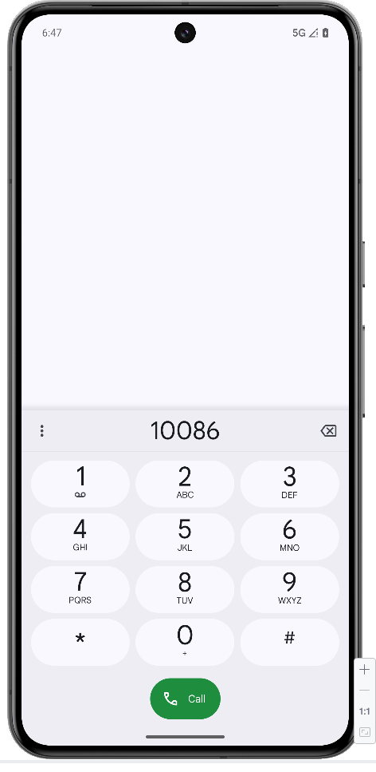
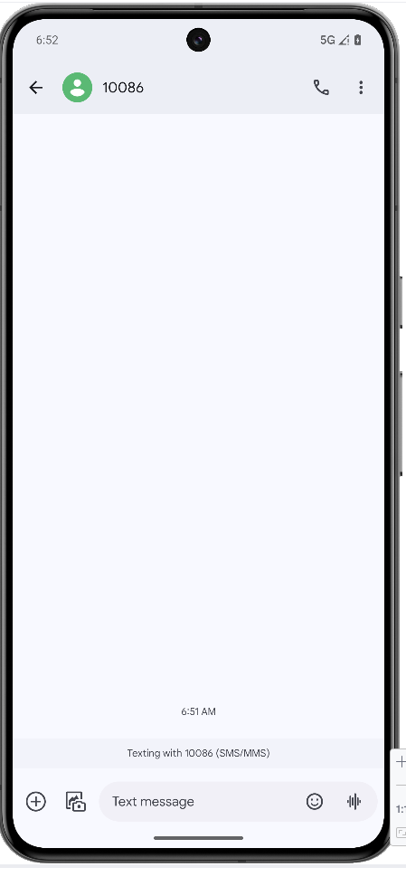
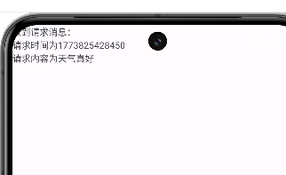
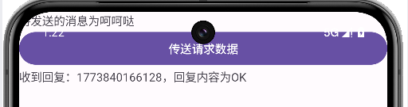
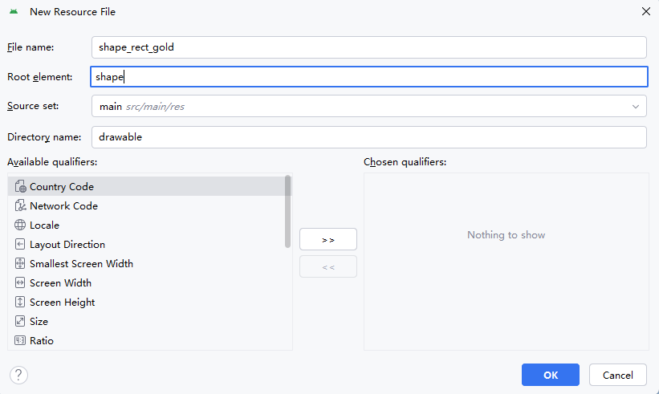
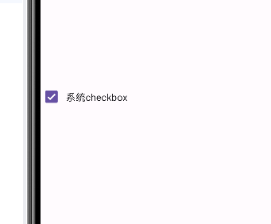
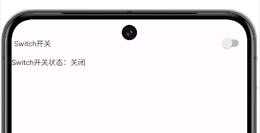

# 1 Android 新项目开发

首先需要下载Android Studio。

然后创建项目时使用Empty Views Activity。

在配置项目时，需要选择Java语言，然后最低的SDK选择API28，能够兼容安卓9.0即可。


创建完毕后，就能看到一个基础项目。


## 1.1 基础项目

首先，app目录是主要的工作区。

`src/main/java`存放Java或Kotlin代码。`com.example.myapplication`是包名，决定了应用在应用商店的唯一性。

`src/main/res`用于存放非代码资源。layout存放xml布局文件，drawable存放图片，values存放颜色、字符串、样式等。`AndroidManifest.xml`记录用户的名称、图标、界面和需要的权限。

`Gradle`定义了应用编译版本、第三方库等。

```java
package com.example.myapplication;

import android.os.Bundle;

import androidx.activity.EdgeToEdge;
import androidx.appcompat.app.AppCompatActivity;
import androidx.core.graphics.Insets;
import androidx.core.view.ViewCompat;
import androidx.core.view.WindowInsetsCompat;

// MainActivity 继承AppCompatActivity，能够适配不同版本的Android
public class MainActivity extends AppCompatActivity {

    // onCreate Activity的生命周期方法，页面被创建时自动调用onCreate方法。
    @Override
    protected void onCreate(Bundle savedInstanceState) {
        // 通过super运行父类的初始化代码
        super.onCreate(savedInstanceState);
        // 让应用内容充满整个屏幕
        EdgeToEdge.enable(this);
        // 将当前的Java代码与activity_main的xml布局绑定起来
        setContentView(R.layout.activity_main);
        // 使用监听器处理全屏适配，确保按钮或蚊子不会被手机刘海或下方虚拟按键挡住
        ViewCompat.setOnApplyWindowInsetsListener(findViewById(R.id.main), (v, insets) -> {
            // 获取当前状态栏和导航栏占用空间，Insets对象保存了上下左右四个方向的占用像素值
            Insets systemBars = insets.getInsets(WindowInsetsCompat.Type.systemBars());
            // 将获取到的像素值设置为当前页面的内边距，避免页面被遮挡
            v.setPadding(systemBars.left, systemBars.top, systemBars.right, systemBars.bottom);
            // 将获取到的占用空间信息进行返回，使得其他View也能收到这个通知
            return insets;
        });
    }
}
```

首先，软件内的安卓模拟器需要开启开发者选项，打开USB debugging才能在软件进行调试。


## 1.2 开发语言

App开发有原生开发与混合开发两种技术路线，编程语言为Java和Kotlin。

## 1.3 工作目录结构

项目主要有两个模块：app和Gradle Scripts。

app下有三个目录：，manifests, java和res。

而Gradle Scripts主要是工程的编译配置文件。


### 1.3.1 manifests

manifests是清单文件，描述了应用的包名、权限、声明的四大组件，以及应用的图标和主题。

### 1.3.2 kotlin+java

这里存放业务逻辑代码，可以使用Kotlin或Java。

`com.example.myapplication`是包名，作为应用商店的唯一标识。而`MainActivity`是应用的入口，负责显式UI和用户交互。

`com.example.myapplication (androidTest)`负责仪器化测试，测试必须运行在Android设备上，用来测试UI交互或功能。

`com.example.myapplication (test)`是本地单元测试，运行在本地JVM上，不依赖Android环境。

### 1.3.3 java

`java (generated)`是生成工具在编译期间生成的代码，不需要手动修改。

### 1.3.4 res

`res`是资源文件。安卓采用UI与逻辑分离的思想，由res存放资源文件。`drawable`存放位图或矢量图，`layout`存放XML格式的界面布局文件，`mipmap`存放应用的启动图标，`values`存放字符串、颜色、主题等。`xml`存放其他辅助配置。

### 1.3.5 Gradle Scripts

这是自动化构建系统，安卓项目的构建工具，负责将代码和资源编译成APK或AAB安装包。

`build.gradle.kts (Project: My_Application)`是项目级构建脚本，用来配置整个项目所有模块的插件和全局属性。

`build.gradle.kts (Module: app)`模块级构建脚本。在这里配置DK版本、应用版本号以及第三方库。

`proguard-rules.pro`用来混淆与压缩配置。发布Release版本时，能够使用ProGuard工具对代码进行混淆，防止被反编译。

`gradle.properties`是全局属性配置，如配置编译时的内存大小。

`gradle-wrapper.properties`是Gradle包装器配置。指定了项目的Gradle软件版本。

`libs.versions.toml`版本目录。将所有依赖库的版本号进行集中管理。

`local.properties`本地环境配置。配置本地电脑的Android SDK路径。

`settings.gradle.kts`项目设置。定义了目录包含哪些模块。

### 1.3.6 重要文件AndroidManifest.xml

在项目的manifests目录中，自动创建了`AndroidManifest.xml`文件。

```xml
<?xml version="1.0" encoding="utf-8"?>
<manifest xmlns:android="http://schemas.android.com/apk/res/android"
    xmlns:tools="http://schemas.android.com/tools">

    <application
        android:allowBackup="true"
        android:dataExtractionRules="@xml/data_extraction_rules"
        android:fullBackupContent="@xml/backup_rules"
        android:icon="@mipmap/ic_launcher"
        android:label="@string/app_name"
        android:roundIcon="@mipmap/ic_launcher_round"
        android:supportsRtl="true"
        android:theme="@style/Theme.MyApplication">
        <activity
            android:name=".MainActivity"
            android:exported="true">
            <intent-filter>
                <action android:name="android.intent.action.MAIN" />

                <category android:name="android.intent.category.LAUNCHER" />
            </intent-filter>
        </activity>
    </application>

</manifest>
```

* allowBackup：是否允许应用备份。通过备份，能够在用户数据丢失时进行数据恢复。
* icon：指定App在手机屏幕上显示的图标。
* label：指定App在手机屏幕显示的名称。
* roundIcon：指定App的圆角图标。
* supportsRtl：设置是否支持阿拉伯语、波斯语等从右往左的文字排列顺序。
* theme：指定App的显示风格。

还有，其中的activity标签是活动页面的注册，只有在activity标签中设置了活动页面，才能在手机应用中打开该页面。而配置`MAIN`和`LAUNCHER`，用处就是打开页面后，第一个展示的activity是什么。

## 1.4 页面显示和逻辑处理

Android实际上就是通过XML描绘应用界面，使用Java代码来书写程序逻辑。

这样能够将App的界面设计和代码逻辑分开。

现在尝试在layout中的`activity_main.xml`中编写程序的页面。

```xml
<?xml version="1.0" encoding="utf-8"?>
<LinearLayout
    xmlns:android="http://schemas.android.com/apk/res/android"
    android:layout_width="match_parent"
    android:layout_height="match_parent"
    android:orientation="vertical"
    android:gravity="center">

    <TextView
        android:id="@+id/tv"
        android:layout_width="wrap_content"
        android:layout_height="wrap_content"
        android:text="hello World!"
        />

</LinearLayout>
```

这里在页面中展示了最基础的Hello World文字。


接下来要进行介绍。

1. 声明部分。第一行的`?xml`标签的作用是指定XML的版本以及字符编码。
2. 根布局标签。也就是`LinearLayout`。这是视图组，决定了内部子视图的排列顺序。

* `xmlns:android`：命名空间。指定android库，其他属性以`android:`开头，用来表示这些属性使用的是Android标准库的属性。
* `android:layout_width`和`android:layout_height`，设置当前页面的宽高。使用`match_parent`表示该布局占据父容器的全部空间。
* `android:orientation`用来决定子视图的排列方向，选择`vertical`表示子组件从上到下一次排列。
* `android:gravity`。重力属性，决定所有子视图相对父布局的对齐方式。center让内部标签在屏幕上水平和垂直方向都居中显示。

3. 子控件标签。TextView是文本视图，用于在屏幕上渲染文本。

* `android:id`是资源标识符。`@+id/`表示在`R.java`文件中创建新的ID条目，这样在Java代码中通过`findViewById(r.id.tv)`来找到这个控件。
* `android:layout_width`和`android:layout_height`用于控制控件的大小。`wrap_content`表示控件大小根据内容自适应包裹，恰好显示文字即可。
* `android:text="hello world"`定义了该控件的文本内容。**这里的字符串应进行封装，放到res下的value文件即可。**

那么，接下来能够将主函数`MainActivity`进行修改，在onCreate函数中展示当前已经改好的页面。

```java
package com.example.myapplication;

import android.os.Bundle;
import android.widget.TextView;

import androidx.appcompat.app.AppCompatActivity;

// MainActivity 继承AppCompatActivity，能够适配不同版本的Android
public class MainActivity extends AppCompatActivity {

    // onCreate Activity的生命周期方法，页面被创建时自动调用onCreate方法。

    @Override
    protected void onCreate(Bundle savedInstanceState) {
        // 通过super运行父类的初始化代码
        super.onCreate(savedInstanceState);
        // 在页面加载布局文件activity_main.xml
        setContentView(R.layout.activity_main);
        // 从布局文件中找到id为tv的TextView控件
        TextView tv = findViewById(R.id.tv);
        // 修改控件的文本内容
        tv.setText("你好，世界");
    }
}
```

这样，就实现了自己创建页面，并在主函数中展示页面和修改页面内容。

## 1.5 Activity跳转

创建App页面有三个步骤。

1. 在layout目录中创建xml文件。
2. 创建与xml文件对应的Java代码。
3. 在`AndroidManifest.xml`中注册页面。

### 1.5.1 创建xml文件

首先，在layout中创建xml页面时，能够直接指定创建的xml文件类型，选择layout类型即可。

```xml
<?xml version="1.0" encoding="utf-8"?>
<LinearLayout xmlns:android="http://schemas.android.com/apk/res/android"
    android:layout_width="match_parent"
    android:layout_height="match_parent"
    android:orientation="vertical"
    android:gravity="center">
    
    <TextView
        android:layout_width="wrap_content"
        android:layout_height="wrap_content"
        android:text="@string/text"/>

</LinearLayout>
```

其中，指定字符串最好的方法是`@string/path`。这会自动在values下的string文件中寻找对应name为text的标签内容作为最终的字符串。

```xml
<resources>
    <string name="app_name">My Application</string>
    <string name="hello_world">Hello World!</string>
    <string name="text">你好，世界</string>
</resources>
```

### 1.5.2 构造MainActicity2的Java文件

```java
package com.example.myapplication;

import android.os.Bundle;

import androidx.appcompat.app.AppCompatActivity;

public class MainActicity2 extends AppCompatActivity {
    @Override
    protected void onCreate(Bundle savedInstanceState) {
        super.onCreate(savedInstanceState);
        // 展示新的页面
        setContentView(R.layout.activity_main2);
    }
}
```

这样，在新的文件中通过`setContentView`来展示新的页面。

### 1.5.3 注册页面

最后一步就是在`AndroidManifest.xml`中注册这个新的页面。


由于新添加的页面不是主页面，因此不需要配置`intent-filter`属性。

接下来需要在主页面中添加按钮，实现点击跳转的功能。

```java
<?xml version="1.0" encoding="utf-8"?>
<LinearLayout
    xmlns:android="http://schemas.android.com/apk/res/android"
    android:layout_width="match_parent"
    android:layout_height="match_parent"
    android:orientation="vertical"
    android:gravity="center">

    <TextView
        android:id="@+id/tv"
        android:layout_width="wrap_content"
        android:layout_height="wrap_content"
        android:text="@string/hello_world"
        />
    <Button
        android:id="@+id/button"
        android:layout_width="wrap_content"
        android:layout_height="wrap_content"
        android:text="@string/jump"/>

</LinearLayout>
```

这样在主页面上添加了按钮后，在`MainActivity`中为这个按钮添加跳转事件。

```java
package com.example.myapplication;

import android.content.Intent;
import android.os.Bundle;
import android.view.View;
import android.widget.Button;
import android.widget.TextView;

import androidx.appcompat.app.AppCompatActivity;

// MainActivity 继承AppCompatActivity，能够适配不同版本的Android
public class MainActivity extends AppCompatActivity {

    // onCreate Activity的生命周期方法，页面被创建时自动调用onCreate方法。

    @Override
    protected void onCreate(Bundle savedInstanceState) {
        // 通过super运行父类的初始化代码
        super.onCreate(savedInstanceState);
        // 在页面加载布局文件activity_main.xml
        setContentView(R.layout.activity_main);
        // 从布局文件中找到id为tv的TextView控件
        TextView tv = findViewById(R.id.tv);
        // 修改控件的文本内容
        tv.setText("你好，世界");

        // 实现点击跳转
        Button button = findViewById(R.id.button);
        button.setOnClickListener(new View.OnClickListener() {
            @Override
            public void onClick(View v) {
                Intent intent = new Intent();
                intent.setClass(MainActivity.this, MainActicity2.class);
                startActivity(intent);
            }
        });
    }
}
```

首先，要在这里通过`findViewById`来寻找到对应id的按钮。找到按钮后，通过`setOnClickListener`来为这个按钮添加点击监听器，如果按钮被点击，就会执行里面定义的函数。而里面定义的函数是`View.OnClickListener(){}`，这是匿名内部类，在里面重写onClick方法，那么点击按钮时就会运行onClick。

为了实现跳转，需要在onClick方法里定义意图实例。意图中，需要通过setClass来定义跳转的起始点和重点，通过`MainActivity.this`来获取当前位置，再写其他页面对应的Java类，然后通过`startActivity(intent)`就能实现跳转的功能。

# 2. Android 页面

## 2.1 简单控件

简单控件指最基础的组件，用于显示文本、接收输入等。简单控件定义在xml布局文件中，在Activity中进行逻辑处理。为了展示控件的使用，需要在原项目添加模块chapter03。

### 2.1.1 文本显示

设置文本有两种方式。

1. 通过属性`android: text`来读取文本。

在layout下创建`activity_text_view.xml`文件，根标签为`LinearLayout`。

```xml
<?xml version="1.0" encoding="utf-8"?>
<LinearLayout xmlns:android="http://schemas.android.com/apk/res/android"
    android:layout_width="match_parent"
    android:layout_height="match_parent">

    <TextView
        android:id="@+id/tv_hello"
        android:layout_width="wrap_content"
        android:layout_height="wrap_content"
        android:text="@string/say_hello"
        />

</LinearLayout>
```

这样，一个基础页面就完成了。

其中，这里通过`android:text`来读取字符串，字符串需要写在strings文件中。

```xml
<resources>
    <string name="app_name">chapter03</string>
    <string name="say_hello">Hello World!</string>
</resources>
```

接下来在kotlin+java包下创建Activity文件。

```java
package com.example.chapter03;

import android.os.Bundle;
import android.widget.TextView;

import androidx.annotation.Nullable;
import androidx.appcompat.app.AppCompatActivity;

public class TextViewActivity extends AppCompatActivity {
    @Override
    protected void onCreate(@Nullable Bundle savedInstanceState) {
        super.onCreate(savedInstanceState);
        // 设置页面文件
        setContentView(R.layout.activity_text_view);
        // 获取文本控件
        TextView tv = findViewById(R.id.tv_hello);
    }
}
```

这样就实现了文本显示功能。

2. Java代码中获取文本标签，通过`setText`来设置文本。

```java
package com.example.chapter03;

import android.os.Bundle;
import android.widget.TextView;

import androidx.annotation.Nullable;
import androidx.appcompat.app.AppCompatActivity;

public class TextViewActivity extends AppCompatActivity {
    @Override
    protected void onCreate(@Nullable Bundle savedInstanceState) {
        super.onCreate(savedInstanceState);
        // 设置页面文件
        setContentView(R.layout.activity_text_view);
        // 获取文本控件
        TextView tv = findViewById(R.id.tv_hello);
        // 通过setText设置文本内容
        tv.setText("你好，世界");
    }
}
```

### 2.1.2 文本大小

文本大小也有两种设置的方法。

第一种是通过`android:testSize`来给定。

```xml
<?xml version="1.0" encoding="utf-8"?>
<LinearLayout xmlns:android="http://schemas.android.com/apk/res/android"
    android:layout_width="match_parent"
    android:layout_height="match_parent">

    <TextView
        android:id="@+id/tv_hello"
        android:layout_width="wrap_content"
        android:layout_height="wrap_content"
        android:text="@string/say_hello"
        android:textSize="50sp"
        />

</LinearLayout>
```

或者在Java文件中设置。

```java
package com.example.chapter03;

import android.os.Bundle;
import android.widget.TextView;

import androidx.annotation.Nullable;
import androidx.appcompat.app.AppCompatActivity;

public class TextViewActivity extends AppCompatActivity {
    @Override
    protected void onCreate(@Nullable Bundle savedInstanceState) {
        super.onCreate(savedInstanceState);
        // 设置页面文件
        setContentView(R.layout.activity_text_view);
        // 获取文本控件
        TextView tv = findViewById(R.id.tv_hello);
        // 通过setText设置文本内容
        tv.setText("你好，世界");
        // 设置文本大小
        tv.setTextSize(50);
    }
}
```

### 2.1.3 文本颜色

文本颜色也有两种。

第一种是在xml页面设置`android:textColor`。

第二种是在Java上设置`setTextColor`。

而颜色通常是在values文件夹里的colors文件中指定，这样能够在其他文件里调用。

还有背景颜色能够通过`setBackgroundColor`来进行设置。

### 2.1.4 视图宽高

视图是指屏幕上一个可交互的矩形区域。而视图宽高可以有三种方式进行设置。

1. match_parent。与上级视图保持一致。如果没有上一级，就填满整个屏幕。
2. wrap_content。与内容自适应。
3. dp。通过指定dp来控制尺寸。

### 2.1.5 视图间距

视图间距是指视图与视图之间、视图与边界之间的空间距离。主要有外边距margin和内边距padding。外边距是指当前视图与其他视图之间的距离。内边距是指视图内容和当前视图的边框之间的距离。

### 2.1.6 对齐方式

视图有两种对齐方式。

1. layout_gravity属性。指定了当前视图相对于上级视图的对齐方式。

如果要指定当前视图在父容器的顶端、下方等位置，使用`android:layout_gravity="top"`等即可。

2. gravity属性，指定了下级视图相对于当前视图的对齐方式。


上面第一个LinearLayout指定了`layout_gravity`属性，就使得该视图处于父容器的底部。

而此时可以看到，该视图内的子视图默认处于左上角。而使用`gravity`属性设置为bottom，就会让子视图处于当前视图的底部。


### 2.1.7 常用布局

#### 2.1.7.1 线性布局LinearLayout

线性布局是指按照一个方向来排列子视图，而这个方向只能说水平或者垂直，通过`android:orientation`来指定。

也就是说，如果在线性视图中定义了两个按钮，水平线性布局会导致两个按钮一左一右在视图的左上角排列。而垂直线性布局会使两个按钮一上一下在视图的左上角排列。

水平布局中还有一个属性`layout_weight`。作用是指定权重。在视图中如果有多个视图，希望这些视图按照比例来分配空间，就可以使用这个权重来自动分配，而相关视图的宽或者高需要设置为0dp。

比如两个视图的宽均设置为0dp，而`layout_weight`分嗯别设置为1和2，那么第一个视图的宽会占据父视图的1/3，第二个视图会占据2/3。而这个权重属性会自动识别宽或高。

#### 2.1.7.2 相对布局

相对布局RelativeLayout是根据其他View或父布局的位置关系来摆放控件的布局容器。

在相对布局中给定两个子视图bt1和bt2，那么可以通过`android:layout_toRightOf="@id/btn1"`来设置视图bt2位于bt1的右方。这样设置参照物来指定视图位置。


这里设置了一个子视图，如果没有设置其他属性，那么当前视图会默认在左上角。如果要显示在父视图的中间，可以使用`layout_centerInParent="true"`，这样就是让当前视图位于父容器的中间。


#### 2.1.7.3 网格布局

网格布局是将当前的视图按行数、列数进行划分。通过columnCount指定列数，也就是每行能够存放多少个视图，rowCount指定行数，也就是每列存放多少个视图。


在这里的视图设置了columnCount和rowCount均为2，那么当前视图就会被分为4块，每一块分别从左到右、从上到下来分配给子视图使用。

而由于子视图手动设置宽高，导致父视图未填满页面，因此可以让子视图使用权重来分配空间。


同时添加gravity属性，让子视图内子视图居中，也就是让文本居中。

### 2.1.8 滚动视图

滚动视图用于屏幕滚动。主要由两种：

1. 垂直滚动`ScrollView`。垂直滚动时，`layout_width`设置为`match_parent`，`layout_height`设置为`wrap_content`。
2. 水平滚动`HorizontalScrollView`。`layout_width`设置为`wrap_content`，`layout_height`设置为`match_parent`。 

```xml
<?xml version="1.0" encoding="utf-8"?>
<LinearLayout xmlns:android="http://schemas.android.com/apk/res/android"
    android:layout_width="match_parent"
    android:layout_height="match_parent"
    android:orientation="vertical">

    <HorizontalScrollView
        android:layout_width="wrap_content"
        android:layout_height="200dp">

        <LinearLayout
            android:layout_width="wrap_content"
            android:layout_height="match_parent"
            android:orientation="horizontal">

            <View
                android:layout_width="300dp"
                android:layout_height="match_parent"
                android:background="#aaffff" />

            <View
                android:layout_width="300dp"
                android:layout_height="match_parent"
                android:background="#ffff00"/>

        </LinearLayout>

    </HorizontalScrollView>

    <ScrollView
        android:layout_width="match_parent"
        android:layout_height="wrap_content">

        <LinearLayout
            android:layout_width="wrap_content"
            android:layout_height="match_parent"
            android:orientation="vertical">

            <View
                android:layout_width="match_parent"
                android:layout_height="400dp"
                android:background="#00ff00" />

            <View
                android:layout_width="match_parent"
                android:layout_height="400dp"
                android:background="#ffffaa"/>

        </LinearLayout>

    </ScrollView>

</LinearLayout>
```

这个页面存在两个视图，宽度分别为300dp，已经超出视图。那么只要使用`HorizontalScrollView`包裹，就能成功实现水平方向的滚动。而垂直滚动也是一样，通过`ScrollView`并使用垂直的LinearLayout，就能给出两个VIew，实现垂直滚动。

### 2.1.9 按钮

按钮Button继承了TextView，因此可以按照HTML的形式来使用Button。

Button拥有默认的按钮背景，而TextView没有背景；

Button内部会居中对齐，而TextView默认靠左对齐。

```xml
<?xml version="1.0" encoding="utf-8"?>
<LinearLayout xmlns:android="http://schemas.android.com/apk/res/android"
    android:layout_width="match_parent"
    android:layout_height="match_parent"
    android:orientation="vertical">
    
    <TextView
        android:layout_width="match_parent"
        android:layout_height="wrap_content"
        android:text="下面的按钮英文默认大写"
        android:textColor="@color/black"
        android:textSize="17sp"/>
    
    <Button
        android:layout_width="match_parent"
        android:layout_height="wrap_content"
        android:text="Hello World!"
        android:textColor="@color/black"
        android:textSize="17sp"/>
    
</LinearLayout>
```


同样的，按钮可以使用onClick来配置事件。但现在不推荐，使用`setOnClickListener`更合适。

按钮拥有点击事件和长按事件。

点击事件通过`setOnCLickListener`来设置，长按事件通过`setOnLongClickListener`来设置。

```xml
<?xml version="1.0" encoding="utf-8"?>
<LinearLayout xmlns:android="http://schemas.android.com/apk/res/android"
    android:layout_width="match_parent"
    android:layout_height="match_parent"
    android:orientation="vertical">

    <TextView
        android:layout_width="match_parent"
        android:layout_height="wrap_content"
        android:text="下面的按钮英文默认大写"
        android:textColor="@color/black"
        android:textSize="17sp"/>

    <Button
        android:id="@+id/btn_single"
        android:layout_width="match_parent"
        android:layout_height="wrap_content"
        android:text="单独的点击监听器"
        android:textColor="@color/black"
        android:textSize="17sp"/>
    
    <TextView
        android:id="@+id/tv_result"
        android:layout_width="match_parent"
        android:layout_height="wrap_content"
        android:padding="5dp"
        android:gravity="center"
        android:textColor="#000000"
        android:textSize="15sp"
        android:text="按钮点击结果"/>

</LinearLayout>
```

首先如果要设置监听器，需要为按钮添加id，方便使用Java获取标签。

```java
package com.example.chapter03;

import android.os.Bundle;
import android.text.format.DateUtils;
import android.view.View;
import android.widget.Button;
import android.widget.TextView;

import androidx.appcompat.app.AppCompatActivity;

import org.w3c.dom.Text;

public class MainActivity extends AppCompatActivity {

    @Override
    protected void onCreate(Bundle savedInstanceState) {
        super.onCreate(savedInstanceState);
        setContentView(R.layout.activity_button_style);
        Button btn = findViewById(R.id.btn_single);
        TextView tv_result = findViewById(R.id.tv_result);
        btn.setOnClickListener(new MyOnClickListener(tv_result));
    }

    static class MyOnClickListener implements View.OnClickListener {
        private final TextView tv_result;
        public MyOnClickListener(TextView tv_result) {
            this.tv_result = tv_result;
        }
        @Override
        public void onClick (View v) {
            String desc = String.format("按钮 %s 被点击了", ((Button) v).getText());
            tv_result.setText(desc);
        }
    }
}
```

这样，为一个按钮添加事件，需要新增一个静态类，实现传入需要改变的组件，并设置组件修改方式。

还有一种方法，是让当前的Activity继承`View.OnClickListener`，然后实现`onClick`方法，在当前activity就能通过`setOnClickListener(this)`来调用当前重写的onClick方法。

而长按按钮在按钮中与普通按钮一致。

```xml
<?xml version="1.0" encoding="utf-8"?>
<LinearLayout xmlns:android="http://schemas.android.com/apk/res/android"
    android:layout_width="match_parent"
    android:layout_height="match_parent"
    android:orientation="vertical">

    <TextView
        android:layout_width="match_parent"
        android:layout_height="wrap_content"
        android:text="下面的按钮英文默认大写"
        android:textColor="@color/black"
        android:textSize="17sp"/>

    <Button
        android:id="@+id/btn_single"
        android:layout_width="match_parent"
        android:layout_height="wrap_content"
        android:text="单独的点击监听器"
        android:textColor="@color/black"
        android:textSize="17sp"/>

    <TextView
        android:id="@+id/tv_result"
        android:layout_width="match_parent"
        android:layout_height="wrap_content"
        android:padding="5dp"
        android:gravity="center"
        android:textColor="#000000"
        android:textSize="15sp"
        android:text="按钮点击结果"/>

    <Button
        android:id="@+id/btn_long"
        android:layout_width="match_parent"
        android:layout_height="wrap_content"
        android:text="单独的长按监听器"
        android:textColor="@color/black"
        android:textSize="17sp"/>

</LinearLayout>
```

下面就使用Lambda来实现长按的功能。

```java
package com.example.chapter03;

import android.os.Bundle;
import android.view.View;
import android.widget.Button;
import android.widget.TextView;

import androidx.appcompat.app.AppCompatActivity;

public class MainActivity extends AppCompatActivity {

    @Override
    protected void onCreate(Bundle savedInstanceState) {
        super.onCreate(savedInstanceState);
        setContentView(R.layout.activity_button_style);
        Button btn = findViewById(R.id.btn_single);
        TextView tv_result = findViewById(R.id.tv_result);
        btn.setOnClickListener(new MyOnClickListener(tv_result));

        Button btn_long_click = findViewById(R.id.btn_long);
        // 使用Lambda表达式设置长按监听器
        btn_long_click.setOnLongClickListener(v -> {
            // 其中的v表示调用该方法的对象，这里指btn_long_click
            String desc = String.format("按钮 %s 被长按了", ((Button) v).getText());
            tv_result.setText(desc);
            return true;
        });

    }

    static class MyOnClickListener implements View.OnClickListener {
        private final TextView tv_result;
        public MyOnClickListener(TextView tv_result) {
            this.tv_result = tv_result;
        }
        @Override
        public void onClick (View v) {
            String desc = String.format("按钮 %s 被点击了", ((Button) v).getText());
            tv_result.setText(desc);
        }
    }

}
```

此外，按钮有禁用和恢复的状态。按钮存在`enabled`属性，true为可点击，false为不可点击。


上面长按按钮设置为false，页面中的按钮就不可点击。

### 2.1.10 图像视图

图像的图片通常位于`res/drawable`中。


```xml
<?xml version="1.0" encoding="utf-8"?>
<LinearLayout xmlns:android="http://schemas.android.com/apk/res/android"
    android:layout_width="match_parent"
    android:layout_height="match_parent"
    android:orientation="vertical">
    
    <ImageView
        android:id="@+id/iv_image"
        android:layout_width="match_parent"
        android:layout_height="220dp"
        android:layout_marginTop="5dp"
        android:contentDescription="一只猫"
        android:src="@drawable/cat"/>

</LinearLayout>
```

在这里通过ImageView设置了一只猫的图片，需要指定它的src和contentDescription。

```java
package com.example.chapter03;

import android.os.Bundle;
import android.widget.ImageView;

import androidx.appcompat.app.AppCompatActivity;

public class ImageViewActivity extends AppCompatActivity {

    @Override
    protected void onCreate(Bundle savedInstanceState) {
        super.onCreate(savedInstanceState);
        setContentView(R.layout.activity_image_scale);

        ImageView imageView = findViewById(R.id.iv_image);
        // 设置图片的src
        imageView.setImageResource(R.drawable.cat);
    }
}
```

> 这里也可以通过`setImageResource`来设置图片标签的路径。

这里创建了新的Activity后，需要在AndroidManifest上修改activity的exported为true。


### 2.1.11 图像按钮

ImageButton是显示图片的图像按钮，继承自ImageView。

| ImageButton                  | Button                     |
| ---------------------------- | -------------------------- |
| 只能显示图片                 | 即可显示图片，也能显示文本 |
| 图片可以按比例缩放           | 图像会被拉伸变形           |
| 可以在前景和背景各放一张图片 | 只能设置背景一张图片       |

```xml
<?xml version="1.0" encoding="utf-8"?>
<LinearLayout xmlns:android="http://schemas.android.com/apk/res/android"
    android:layout_width="match_parent"
    android:layout_height="match_parent"
    android:orientation="vertical">

    <ImageView
        android:id="@+id/iv_image"
        android:layout_width="match_parent"
        android:layout_height="220dp"
        android:layout_marginTop="5dp"
        android:contentDescription="一只猫"
        android:src="@drawable/cat"/>

    <ImageButton
        android:layout_width="match_parent"
        android:layout_height="80dp"
        android:src="@drawable/cat"
        android:contentDescription="一只猫"
        android:scaleType="fitCenter"/>
</LinearLayout>
```

这里就添加了一个图像按钮。


### 2.1.12 同时显示图像和文本

同时显示图像和文本，可以使用drawable。

```xml
<?xml version="1.0" encoding="utf-8"?>
<LinearLayout xmlns:android="http://schemas.android.com/apk/res/android"
    android:layout_width="match_parent"
    android:layout_height="match_parent"
    android:orientation="vertical">

    <Button
        android:layout_width="wrap_content"
        android:layout_height="wrap_content"
        android:background="#FFFFFF"
        android:drawableLeft="@drawable/cat"
        android:text="图标在左"
        android:drawablePadding="50dp"/>

</LinearLayout>
```

这里设置的drawableLeft是在当前按钮的左侧添加图片。同样的，可以在这个控件的上下左右添加图片。

## 2.2 计算器项目

现在需要实现一个小项目。计算器的界面分为两大部分，第一部分是上方的计算表达式，即包含用户的输入，也包含计算结果。下方是按键。

### 2.2.1 创建Activity

首先需要创建`CalculatorActivity`。

```java
package com.example.chapter04;

import android.os.Bundle;

import androidx.appcompat.app.AppCompatActivity;

public class CalculatorActivity extends AppCompatActivity {

    @Override
    protected void onCreate(Bundle savedInstanceState) {
        super.onCreate(savedInstanceState);
        
    }
}
```

### 2.2.2 创建xml页面

接下来需要创建计算器的页面，在`activyti_calculator.xml`中实现。

首先，计算器是从上到下设计布局的，因此大视图采用线性布局。如果按键过多，可能需要进行滚动，但左右不需要滚动，因此采用滚动视图`ScrollView`，页面的宽度继承父类`match_parent`，高度匹配内容`wrap_content`。

为了能够在页面中使用字符串表示按键，需要在`strings.xml`中定义字符串。

```xml
<resources>
    <string name="app_name">chapter04</string>
    <string name="calculator">简单计算器</string>
    <string name="cancel">CE</string>
    <string name="divide">÷</string>
    <string name="multiply">×</string>
    <string name="clear">C</string>
    <string name="seven">7</string>
    <string name="eight">8</string>
    <string name="nine">9</string>
    <string name="plus">+</string>
    <string name="four">4</string>
    <string name="five">5</string>
    <string name="six">6</string>
    <string name="minus">-</string>
    <string name="one">1</string>
    <string name="two">2</string>
    <string name="three">3</string>
    <string name="reciprocal">1/x</string>
    <string name="zero">0</string>
    <string name="dot">.</string>
    <string name="equal">=</string>
    <string name="sqrt">sqrt</string>
</resources>
```

还有在values下创建`dimens.xml`写计算器的文本大小和按钮高度，宽度的话可以使用0dp和权重来自适应。

```xml
<?xml version="1.0" encoding="utf-8"?>
<resources>
    <dimen name="button_font_size">30sp</dimen>
    <dimen name="button_height">75dp</dimen>
</resources>
```

首先设计最上方的计算器名称。


然后实现计算器计算结果的框。


接下来是实现按钮。


这样，就实现了第一个按钮。接下来继续实现其他按钮即可。

```xml
<?xml version="1.0" encoding="utf-8"?>
<LinearLayout xmlns:android="http://schemas.android.com/apk/res/android"
    android:layout_width="match_parent"
    android:layout_height="match_parent"
    android:background="#EEEEEE"
    android:orientation="vertical"
    android:padding="5dp">

    <ScrollView
        android:layout_width="match_parent"
        android:layout_height="wrap_content">
        <LinearLayout
            android:layout_width="match_parent"
            android:layout_height="wrap_content"
            android:orientation="vertical">
            <TextView
                android:layout_width="match_parent"
                android:layout_height="wrap_content"
                android:text="@string/calculator"
                android:gravity="center"
                android:textColor="black"
                android:textSize="20sp"/>

            <TextView
                android:id="@+id/tv_result"
                android:layout_width="match_parent"
                android:layout_height="wrap_content"
                android:lines="3"
                android:background="@color/white"
                android:text="@string/zero"
                android:textColor="@color/black"
                android:textSize="25sp"
                android:gravity="end|bottom"/>

            <GridLayout
                android:layout_width="match_parent"
                android:layout_height="wrap_content"
                android:columnCount="4"
                android:rowCount="5">
                <Button
                    android:id="@+id/btn_cancel"
                    android:text="@string/cancel"
                    android:layout_width="0dp"
                    android:layout_height="@dimen/button_height"
                    android:layout_columnWeight="1"
                    android:gravity="center"
                    android:textColor="@color/black"
                    android:textSize="@dimen/button_font_size"/>
                <Button
                    android:id="@+id/btn_divide"
                    android:text="@string/divide"
                    android:layout_width="0dp"
                    android:layout_height="@dimen/button_height"
                    android:layout_columnWeight="1"
                    android:gravity="center"
                    android:textColor="@color/black"
                    android:textSize="@dimen/button_font_size"/>
                <Button
                    android:id="@+id/btn_multiply"
                    android:text="@string/multiply"
                    android:layout_width="0dp"
                    android:layout_height="@dimen/button_height"
                    android:layout_columnWeight="1"
                    android:gravity="center"
                    android:textColor="@color/black"
                    android:textSize="@dimen/button_font_size"/>
                <Button
                    android:id="@+id/btn_clear"
                    android:text="@string/clear"
                    android:layout_width="0dp"
                    android:layout_height="@dimen/button_height"
                    android:layout_columnWeight="1"
                    android:gravity="center"
                    android:textColor="@color/black"
                    android:textSize="@dimen/button_font_size"/>
                <Button
                    android:id="@+id/btn_seven"
                    android:text="@string/seven"
                    android:layout_width="0dp"
                    android:layout_height="@dimen/button_height"
                    android:layout_columnWeight="1"
                    android:gravity="center"
                    android:textColor="@color/black"
                    android:textSize="@dimen/button_font_size"/>
                <Button
                    android:id="@+id/btn_eight"
                    android:text="@string/eight"
                    android:layout_width="0dp"
                    android:layout_height="@dimen/button_height"
                    android:layout_columnWeight="1"
                    android:gravity="center"
                    android:textColor="@color/black"
                    android:textSize="@dimen/button_font_size"/>
                <Button
                    android:id="@+id/btn_nine"
                    android:text="@string/nine"
                    android:layout_width="0dp"
                    android:layout_height="@dimen/button_height"
                    android:layout_columnWeight="1"
                    android:gravity="center"
                    android:textColor="@color/black"
                    android:textSize="@dimen/button_font_size"/>
                <Button
                    android:id="@+id/btn_plus"
                    android:text="@string/plus"
                    android:layout_width="0dp"
                    android:layout_height="@dimen/button_height"
                    android:layout_columnWeight="1"
                    android:gravity="center"
                    android:textColor="@color/black"
                    android:textSize="@dimen/button_font_size"/>
                <Button
                    android:id="@+id/btn_four"
                    android:text="@string/four"
                    android:layout_width="0dp"
                    android:layout_height="@dimen/button_height"
                    android:layout_columnWeight="1"
                    android:gravity="center"
                    android:textColor="@color/black"
                    android:textSize="@dimen/button_font_size"/>
                <Button
                    android:id="@+id/btn_five"
                    android:text="@string/five"
                    android:layout_width="0dp"
                    android:layout_height="@dimen/button_height"
                    android:layout_columnWeight="1"
                    android:gravity="center"
                    android:textColor="@color/black"
                    android:textSize="@dimen/button_font_size"/>
                <Button
                    android:id="@+id/btn_six"
                    android:text="@string/six"
                    android:layout_width="0dp"
                    android:layout_height="@dimen/button_height"
                    android:layout_columnWeight="1"
                    android:gravity="center"
                    android:textColor="@color/black"
                    android:textSize="@dimen/button_font_size"/>
                <Button
                    android:id="@+id/btn_minus"
                    android:text="@string/minus"
                    android:layout_width="0dp"
                    android:layout_height="@dimen/button_height"
                    android:layout_columnWeight="1"
                    android:gravity="center"
                    android:textColor="@color/black"
                    android:textSize="@dimen/button_font_size"/>
                <Button
                    android:id="@+id/btn_one"
                    android:text="@string/one"
                    android:layout_width="0dp"
                    android:layout_height="@dimen/button_height"
                    android:layout_columnWeight="1"
                    android:gravity="center"
                    android:textColor="@color/black"
                    android:textSize="@dimen/button_font_size"/>
                <Button
                    android:id="@+id/btn_two"
                    android:text="@string/two"
                    android:layout_width="0dp"
                    android:layout_height="@dimen/button_height"
                    android:layout_columnWeight="1"
                    android:gravity="center"
                    android:textColor="@color/black"
                    android:textSize="@dimen/button_font_size"/>
                <Button
                    android:id="@+id/btn_three"
                    android:text="@string/three"
                    android:layout_width="0dp"
                    android:layout_height="@dimen/button_height"
                    android:layout_columnWeight="1"
                    android:gravity="center"
                    android:textColor="@color/black"
                    android:textSize="@dimen/button_font_size"/>
                <ImageButton
                    android:id="@+id/btn_sqrt"
                    android:contentDescription="@string/sqrt"
                    android:src="@drawable/sqrt"
                    android:layout_width="0dp"
                    android:layout_height="@dimen/button_height"
                    android:layout_columnWeight="1"
                    android:gravity="center"
                    android:scaleType="fitCenter"
                    android:adjustViewBounds="true"
                    android:padding="8dp"
                    android:background="@null"/>
                <Button
                    android:id="@+id/btn_reciprocal"
                    android:text="@string/reciprocal"
                    android:layout_width="0dp"
                    android:layout_height="@dimen/button_height"
                    android:layout_columnWeight="1"
                    android:gravity="center"
                    android:textColor="@color/black"
                    android:textSize="@dimen/button_font_size"/>
                <Button
                    android:id="@+id/btn_zero"
                    android:text="@string/zero"
                    android:layout_width="0dp"
                    android:layout_height="@dimen/button_height"
                    android:layout_columnWeight="1"
                    android:gravity="center"
                    android:textColor="@color/black"
                    android:textSize="@dimen/button_font_size"/>
                <Button
                    android:id="@+id/btn_dot"
                    android:text="@string/dot"
                    android:layout_width="0dp"
                    android:layout_height="@dimen/button_height"
                    android:layout_columnWeight="1"
                    android:gravity="center"
                    android:textColor="@color/black"
                    android:textSize="@dimen/button_font_size"/>
                <Button
                    android:id="@+id/btn_equal"
                    android:text="@string/equal"
                    android:layout_width="0dp"
                    android:layout_height="@dimen/button_height"
                    android:layout_columnWeight="1"
                    android:gravity="center"
                    android:textColor="@color/black"
                    android:textSize="@dimen/button_font_size"/>


            </GridLayout>
        </LinearLayout>
    </ScrollView>

</LinearLayout>
```


### 2.2.3 逻辑处理

**这里存在很多不合理的地方，暂时丢弃。**

## 2.3 Activity

Activity是屏幕组件，也就是活动。打开App时看到的每一个界面，都是一个Activity。

Activity本身不绘制组件元素，而是作为容器加载XML布局文件来展示页面信息。一个典型的应用应该包含多个Activity，如登录、主页、详情页、设置页等。

**任何Activity都需要在`AndroidManifest.xml`中声明。如果不声明，系统会无法识别并抛出异常。**


### 2.3.1 启动和停止

启动Activity也就是跳转到新页面。

```java
startActivity(new Intent(原页面.this, 目标页面.class));
```

从当前页面回到上一个页面，相当于关闭当前页面。

```java
finish(); // 结束当前的活动页面
```

现在创建两个Activity，分别是ActFinishActivity和ActStartActivity。

```java
package com.example.chapter05;

import android.os.Bundle;

import androidx.appcompat.app.AppCompatActivity;

public class ActFinishActivity extends AppCompatActivity {

    @Override
    protected void onCreate(Bundle savedInstanceState) {
        super.onCreate(savedInstanceState);
        setContentView(R.layout.activity_act_finish);

    }
}
```

```go
package com.example.chapter05;

import android.os.Bundle;

import androidx.appcompat.app.AppCompatActivity;

public class ActStartActivity extends AppCompatActivity {

    @Override
    protected void onCreate(Bundle savedInstanceState) {
        super.onCreate(savedInstanceState);
        setContentView(R.layout.activity_act_start);

    }
}
```

接下来，在`activity_act_start.xml`中添加按钮，能够跳转到新页面。

```xml
<?xml version="1.0" encoding="utf-8"?>
<LinearLayout xmlns:android="http://schemas.android.com/apk/res/android"
    xmlns:app="http://schemas.android.com/apk/res-auto"
    xmlns:tools="http://schemas.android.com/tools"
    android:id="@+id/main"
    android:layout_width="match_parent"
    android:layout_height="match_parent"
    tools:context=".ActStartActivity"
    android:orientation="vertical"
    android:gravity="center">

    <Button
        android:id="@+id/btn_act_next"
        android:layout_width="wrap_content"
        android:layout_height="wrap_content"
        android:text="跳转到下一个页面"/>

</LinearLayout>
```

在`ActStartActivity`中也定义按钮的功能。

```java
package com.example.chapter05;

import android.annotation.SuppressLint;
import android.content.Intent;
import android.os.Bundle;
import android.view.View;
import android.widget.Button;

import androidx.appcompat.app.AppCompatActivity;

public class ActStartActivity extends AppCompatActivity implements View.OnClickListener {

    @Override
    protected void onCreate(Bundle savedInstanceState) {
        super.onCreate(savedInstanceState);
        setContentView(R.layout.activity_act_start);
        // 点击跳转
        findViewById(R.id.btn_act_next).setOnClickListener(this);

    }

    @Override
    public void onClick(View v) {
        // 开始新的界面
        startActivity(new Intent(this, ActFinishActivity.class));
    }
}
```

接下来，需要实现`activity_act_finish.xml`。

```xml
<?xml version="1.0" encoding="utf-8"?>
<LinearLayout xmlns:android="http://schemas.android.com/apk/res/android"
    xmlns:app="http://schemas.android.com/apk/res-auto"
    xmlns:tools="http://schemas.android.com/tools"
    android:id="@+id/main"
    android:layout_width="match_parent"
    android:layout_height="match_parent"
    tools:context=".ActFinishActivity"
    android:orientation="vertical">

    <ImageView
        android:id="@+id/iv_back"
        android:layout_width="60dp"
        android:layout_height="60dp"
        android:padding="5dp"
        android:layout_marginTop="20dp"
        android:src="@drawable/ic_black"/>

    <Button
        android:id="@+id/btn_finish"
        android:layout_width="match_parent"
        android:layout_height="wrap_content"
        android:gravity="center"
        android:text="完成"/>

    <TextView
        android:layout_width="match_parent"
        android:layout_height="wrap_content"
        android:text="按返回键返回"/>

</LinearLayout>
```

然后在`ActFinishActivity`中实现按钮点击返回的功能。

```java
package com.example.chapter05;

import android.os.Bundle;
import android.view.View;

import androidx.appcompat.app.AppCompatActivity;

public class ActFinishActivity extends AppCompatActivity implements View.OnClickListener {

    @Override
    protected void onCreate(Bundle savedInstanceState) {
        super.onCreate(savedInstanceState);
        setContentView(R.layout.activity_act_finish);
        findViewById(R.id.btn_finish).setOnClickListener(this);
        findViewById(R.id.iv_back).setOnClickListener(this);

    }
    @Override
    public void onClick(View v) {
        // 点击这两个按钮，实现关闭页面
        if (v.getId() == R.id.iv_back || v.getId() == R.id.btn_finish) {
            finish();
        }
    }
}
```

这样，就可以实现点击图片和点击按钮返回到上一页。


### 2.3.2 生命周期


Activity的生命周期存在多个阶段。

```java
package com.example.chapter05;

import android.content.Intent;
import android.os.Bundle;
import android.util.Log;
import android.view.View;

import androidx.appcompat.app.AppCompatActivity;

public class ActStartActivity extends AppCompatActivity implements View.OnClickListener {
    
    private static final String TAG = "ning";

    @Override
    protected void onCreate(Bundle savedInstanceState) {
        super.onCreate(savedInstanceState);
        Log.d(TAG, "ActStartActivity onCreate");
        setContentView(R.layout.activity_act_start);
        // 点击跳转
        findViewById(R.id.btn_act_next).setOnClickListener(this);

    }

    @Override
    public void onClick(View v) {
        // 开始新的界面
        startActivity(new Intent(this, ActFinishActivity.class));
    }

    @Override
    protected void onStart() {
        super.onStart();
        Log.d(TAG, "ActStartActivity onStart");
    }

    @Override
    protected void onResume() {
        super.onResume();
        Log.d(TAG, "ActStartActivity onResume");
    }

    @Override
    protected void onPause() {
        super.onPause();
        Log.d(TAG, "ActStartActivity onPause");
    }

    @Override
    protected void onDestroy() {
        super.onDestroy();
        Log.d(TAG, "ActStartActivity onDestroy");
    }

    @Override
    protected void onRestart() {
        super.onRestart();
        Log.d(TAG, "ActStartActivity onRestart");
    }
}
```

通过这里，就能清晰地了解到生命周期位于什么时期。


初次打开时，会执行onCreate。然后进入页面，会有onStart和onResume。onResume用于保持当前页面在线。

如果离开页面，会执行onPause，回到页面执行onRestart。

### 2.3.3 启动模式

Android对于多个Activity启动，有很多种处理方式。最经典的就是使用任务栈，将第一个Activity入栈，接着开启的其他Activity就依次入栈，关闭Activity时也是依次出栈。

Android有四种启动模式。

#### 2.3.3.1 Standard 标准模式

每次启动Activity，系统都会创建Activity实例并压入任务栈中，按顺序入栈和出栈。这是默认的启动方式。

设置方法在`AndroidManifest.xml`中。

```xml
<activity
    android:name=".ActStartActivity"
    android:exported="true"
    android:launchMode="standard">
    <intent-filter>
        <action android:name="android.intent.action.MAIN" />

        <category android:name="android.intent.category.LAUNCHER" />
    </intent-filter>
</activity>
```

#### 2.3.3.2 singleTop 栈顶复用模式

如果如果栈顶的Activity就是接下来要新建的Activity，就不会重复创建新的Activity入栈，而是直接复用。

```xml
<activity
    android:name=".ActStartActivity"
    android:exported="true"
    android:launchMode="singleTop">
    <intent-filter>
        <action android:name="android.intent.action.MAIN" />

        <category android:name="android.intent.category.LAUNCHER" />
    </intent-filter>
</activity>
```

这种适用于微信应用打开微信支付、打开微信小程序等，就可以使用栈顶复用，避免新建多个Activity入栈。

#### 2.3.3.3 SingleTask栈内复用

如果新建的Activity存在于栈中，那么就会将该栈帧上的所有栈元素全部出栈，仅留下当前栈以及栈帧下的栈。

```xml
<activity
    android:name=".ActStartActivity"
    android:exported="true"
    android:launchMode="singleTask">
    <intent-filter>
        <action android:name="android.intent.action.MAIN" />

        <category android:name="android.intent.category.LAUNCHER" />
    </intent-filter>
</activity>
```

#### 2.3.3.4 SingleInstance单实例模式

Activity独占一个栈，这个栈只能有一个实例。后续任何请求都会复用这一个实例。

```xml
<activity
    android:name=".ActStartActivity"
    android:exported="true"
    android:launchMode="singleInstance">
    <intent-filter>
        <action android:name="android.intent.action.MAIN" />

        <category android:name="android.intent.category.LAUNCHER" />
    </intent-filter>
</activity>
```

#### 2.3.3.5 示例

接下来创建两个页面，分别对应JumpFirstActivity和JumpSecondActivity。

```xml
<?xml version="1.0" encoding="utf-8"?>
<LinearLayout xmlns:android="http://schemas.android.com/apk/res/android"
    xmlns:app="http://schemas.android.com/apk/res-auto"
    xmlns:tools="http://schemas.android.com/tools"
    android:id="@+id/main"
    android:layout_width="match_parent"
    android:layout_height="match_parent"
    tools:context=".JumpFirstActivity"
    android:orientation="vertical">

    <Button
        android:id="@+id/btn_jump_second"
        android:layout_width="match_parent"
        android:layout_height="wrap_content"
        android:layout_marginTop="50dp"
        android:text="跳到第二个页面"/>
</LinearLayout>
```

```xml
<?xml version="1.0" encoding="utf-8"?>
<LinearLayout xmlns:android="http://schemas.android.com/apk/res/android"
    xmlns:app="http://schemas.android.com/apk/res-auto"
    xmlns:tools="http://schemas.android.com/tools"
    android:id="@+id/main"
    android:layout_width="match_parent"
    android:layout_height="match_parent"
    tools:context=".JumpSecondActivity"
    android:orientation="vertical">

    <Button
        android:id="@+id/btn_jump_first"
        android:layout_width="match_parent"
        android:layout_height="wrap_content"
        android:layout_marginTop="50dp"
        android:text="跳到第一个页面" />
</LinearLayout>
```

```java
package com.example.chapter05;

import android.content.Intent;
import android.os.Bundle;
import android.view.View;

import androidx.appcompat.app.AppCompatActivity;

public class JumpFirstActivity extends AppCompatActivity implements View.OnClickListener {

    @Override
    protected void onCreate(Bundle savedInstanceState) {
        super.onCreate(savedInstanceState);
        setContentView(R.layout.activity_jump_first);
        findViewById(R.id.btn_jump_second).setOnClickListener(this);
    }

    @Override
    public void onClick(View v) {
        // 点击跳转
        Intent intent = new Intent(this, JumpSecondActivity.class);
        // 战中存在待跳转的活动实例时，重新创建该活动的实例，同时清除原实例上的所有实例
        intent.setFlags(Intent.FLAG_ACTIVITY_CLEAR_TOP);
        startActivity(intent);
    }
}
```

```java
package com.example.chapter05;

import android.content.Intent;
import android.os.Bundle;
import android.view.View;

import androidx.appcompat.app.AppCompatActivity;

public class JumpSecondActivity extends AppCompatActivity implements View.OnClickListener {

    @Override
    protected void onCreate(Bundle savedInstanceState) {
        super.onCreate(savedInstanceState);
        setContentView(R.layout.activity_jump_second);
        findViewById(R.id.btn_jump_first).setOnClickListener(this);
    }

    @Override
    public void onClick(View v) {
        // 点击跳转
        Intent intent = new Intent(this, JumpFirstActivity.class);
        // 栈中存在待跳转的活动实例时，重新创建该活动的实例，同时清除原实例上的所有实例
        intent.setFlags(Intent.FLAG_ACTIVITY_CLEAR_TOP);
        startActivity(intent);
    }
}
```

然后在`AndroidManifest.xml`中将这个JumpFirstActivity作为主页面。

```xml
<?xml version="1.0" encoding="utf-8"?>
<manifest xmlns:android="http://schemas.android.com/apk/res/android">

    <application
        android:allowBackup="true"
        android:icon="@mipmap/ic_launcher"
        android:label="@string/app_name"
        android:roundIcon="@mipmap/ic_launcher_round"
        android:supportsRtl="true"
        android:theme="@style/Theme.MyApplication">
        <activity
            android:name=".JumpSecondActivity"
            android:exported="false" />
        <activity
            android:name=".JumpFirstActivity"
            android:exported="true"
            android:launchMode="singleInstance">
            <intent-filter>
                <action android:name="android.intent.action.MAIN" />

                <category android:name="android.intent.category.LAUNCHER" />
            </intent-filter>
        </activity>
    </application>

</manifest>
```

这里就实现了从A跳到B、然后从B又跳到A的行为。但如果点击返回键，就能发现从B返回到A，再返回就回到了桌面，说明此时任务栈中只有两个栈。这里的`Intent.FLAG_ACTIVITY_CLEAR_TOP`保证了栈中不存在两个相同的实例，一旦在栈中发现即将新建的实例，就会将这个栈中以上的实例全部弹出销毁，不新建实例，让旧实例成为栈顶。

如果不设置的话，多次从A跳到B再跳到A，按返回键时就会从A返回到B、从B返回到A一直重复。

但如果任务是登录验证页面，弹出验证成功后就不需要回到验证页面，那么就要采用清空任务栈并新建任务栈的模式。

```java
package com.example.chapter05;

import android.content.Intent;
import android.os.Bundle;
import android.view.View;

import androidx.appcompat.app.AppCompatActivity;

public class LoginInputActivity extends AppCompatActivity implements View.OnClickListener {

    @Override
    protected void onCreate(Bundle savedInstanceState) {
        super.onCreate(savedInstanceState);
        setContentView(R.layout.activity_login_input);
        findViewById(R.id.btn_jump_success).setOnClickListener(this);
    }

    @Override
    public void onClick(View v) {
        Intent intent = new Intent(this, LoginSuccessActivity.class);
        // 清空原有的任务栈，在新的任务栈中创建实例
        intent.setFlags(Intent.FLAG_ACTIVITY_CLEAR_TASK | Intent.FLAG_ACTIVITY_NEW_TASK);
        startActivity(intent);
    }
}
```

只要当前的启动模式为standard，那么这里跳转到新的页面，再点击返回时，就会退回到桌面，因为旧的任务栈被清除，新的任务栈只有新跳转的页面。

### 2.3.4 Intent

上面实现了Activity的跳转，接下来需要实现Activity的消息传递。

Intent是各个Activity之间信息沟通的桥梁，主要有三个作用。

1. 表示跳转，从当前的Activity跳转到哪里去。通过`new Intent()`来指定。
2. 发送数据到接收方。通过`intent.setData()`来传输数据。
3. 发送方如果要得到接收方的处理结果，intent就要负责让接收方传回数据。

#### 2.3.4.1 显式意图

显式Intent直接指定来源活动和目标活动，能够确保从当前活动跳转到目的目的活动。

```java
// 指定从当前活动this跳转到目标活动LoginSuccessActivity
Intent intent = new Intent(this, LoginSuccessActivity.class);
```

或者使用Component来指定。

```java
Intent intent = new Intent();
ComponentName component = new ComponentName(this, LoginSuccessActivity.class);
intent.setComponent(component)
```

在这里能够看到，`new Intent()`里直接传入源活动和目标活动其实是一个语法糖。

#### 2.3.4.2 隐式意图

隐式Intent不希望向外部透露活动名称，就给出事先定义好的标记字符串，根据这个字符串能够获取匹配到的活动。

其中，MAIN表示主入口，VIEW表示显示数据，SEND表示分享内容，CALL表示直接拨号，DIAL表示准备拨号，SENDTO表示发送短信，ANSWER表示接听电话。

这里先创建`activity_action_uri.xml`来实现隐式意图的页面。

```xml
<?xml version="1.0" encoding="utf-8"?>
<LinearLayout xmlns:android="http://schemas.android.com/apk/res/android"
    xmlns:app="http://schemas.android.com/apk/res-auto"
    xmlns:tools="http://schemas.android.com/tools"
    android:id="@+id/main"
    android:layout_width="match_parent"
    android:layout_height="match_parent"
    tools:context=".ActionUriActivity"
    android:orientation="vertical">
    
    <TextView
        android:layout_width="match_parent"
        android:layout_height="wrap_content"
        android:padding="5dp"
        android:text="点击下面按钮发送请求"/>
    
    <Button
        android:id="@+id/btn_dial"
        android:layout_width="match_parent"
        android:layout_height="wrap_content"
        android:text="跳到拨号页面"/>

    <Button
        android:id="@+id/btn_sms"
        android:layout_width="match_parent"
        android:layout_height="wrap_content"
        android:text="跳到短信页面"/>

    <Button
        android:id="@+id/btn_my"
        android:layout_width="match_parent"
        android:layout_height="wrap_content"
        android:text="跳到我的页面"/>

</LinearLayout>
```

接下来在ActionUriActivity中能够定义隐式Intent。

```java
package com.example.chapter05;

import android.content.Intent;
import android.net.Uri;
import android.os.Bundle;

import androidx.appcompat.app.AppCompatActivity;

import android.view.View;

public class ActionUriActivity extends AppCompatActivity implements View.OnClickListener {

    @Override
    protected void onCreate(Bundle savedInstanceState) {
        super.onCreate(savedInstanceState);
        setContentView(R.layout.activity_action_uri);
        findViewById(R.id.btn_dial).setOnClickListener(this);
        findViewById(R.id.btn_sms).setOnClickListener(this);
        findViewById(R.id.btn_my).setOnClickListener(this);

    }

    @Override
    public void onClick(View v) {
        if (v.getId() == R.id.btn_dial) {
            Intent intent = new Intent();
            intent.setAction(Intent.ACTION_DIAL);
            Uri uri = Uri.parse("tel: " + "10086");
            intent.setData(uri);
            startActivity(intent);
        }
    }
}
```

其中，`Intent.ACTION_DIAL`属于常量，会寻找对应的`intent.action.DIAL`的Activity进行跳转。而`DIAL`页面是系统自带的，因此会自动调出系统的拨号盘。



而如果自定义了一个Activity，在AndroidManifest指定了filter的action name为`android.intent.action.DIAL`，就会存在两个匹配的Activity供调用，手机上就会弹出选择框，能够选择两个其中一个来打开。这就是手机打开网址时，能够手动选择使用什么浏览器打开的场景。

同样的，发送短信也是一样的做法，Action使用`Intent.ACTION_SENDTO`即可匹配本机的短信。

```java
@Override
public void onClick(View v) {
    if (v.getId() == R.id.btn_dial) {
        Intent intent = new Intent();
        intent.setAction(Intent.ACTION_DIAL);
        Uri uri = Uri.parse("tel: " + "10086");
        intent.setData(uri);
        startActivity(intent);
    }else if (v.getId() == R.id.btn_sms) {
        Intent intent = new Intent();
        intent.setAction(Intent.ACTION_SENDTO);
        Uri uri = Uri.parse("smsto: " + "10086");
        intent.setData(uri);
        startActivity(intent);
    }
}
```




而如果想要跳转到自己的应用，就需要定义好xml页面和Activity后，在AndroidManifest中通过filter指定它的Action name。

```xml
<activity android:name=".LoginInputActivity"
    android:exported="true">
    <intent-filter>
        <action android:name="android.intent.action.MY" />
        <category android:name="android.intent.category.DEFAULT" />
    </intent-filter>
</activity>
```

其中，exported为true表示可以被其他应用启动。这里设置了action和category，给定了目标词MY，让隐式Intent能够根据这个目标词来进行匹配。

接着修改ActionUriActivity，添加这个功能。

```java
@Override
public void onClick(View v) {
    if (v.getId() == R.id.btn_dial) {
        Intent intent = new Intent();
        intent.setAction(Intent.ACTION_DIAL);
        Uri uri = Uri.parse("tel: " + "10086");
        intent.setData(uri);
        startActivity(intent);
    }else if (v.getId() == R.id.btn_sms) {
        Intent intent = new Intent();
        intent.setAction(Intent.ACTION_SENDTO);
        Uri uri = Uri.parse("smsto: " + "10086");
        intent.setData(uri);
        startActivity(intent);
    }else if (v.getId() == R.id.btn_my) {
        Intent intent = new Intent();
        intent.setAction("android.intent.action.MY");
        intent.addCategory(Intent.CATEGORY_DEFAULT);
        startActivity(intent);
    }
}
```

这样，点击按钮后，就能通过隐式Intent，根据MY来进行匹配，跳转到匹配的页面。

这里存在一个问题：定义的Action和Category有什么区别？

Action描述的是这个动作。如VIEW表示查看网页，CALL表示拨打电话，这种操作是通过动作来命名的。

Category表示能够执行这个动作的组件的上下文。如果跳转的是新的桌面应用，就可以指定Category为LAUNCHER，这样只会找Category对应为LAUNCHER的Activity，或者设置页面PERFERENCE等。其中，一个Activity可以指定多个Category，如同浏览器可用于查看页面、打开设置或者打开其他应用，那么这个浏览器的Category可以添加DEFAULT、PREFERENCE或者LAUNCHER。

此外，自定义Category如果仅添加分类`"android.intent.category.MY_PAGE"`，系统会识别不了，需要额外添加上DEFAULT，系统才能识别。

```xml
<intent-filter>
    <action android:name="android.intent.action.MY" />
    <category android:name="android.intent.category.MY_PAGE" />
    <category android:name="android.intent.category.DEFAULT" />
</intent-filter>
```

### 2.3.5 传递数据

如果使用Intent跳转时需要传递数据，最好的方法是使用Bundle对象来存放数据。

这里的存取数据采用的依旧是get和set方法。例如存取int使用`getInt`和`setInt`，存取字符串数组使用`getStringArray`和`setStringArray`。

```xml
<?xml version="1.0" encoding="utf-8"?>
<LinearLayout xmlns:android="http://schemas.android.com/apk/res/android"
    xmlns:app="http://schemas.android.com/apk/res-auto"
    xmlns:tools="http://schemas.android.com/tools"
    android:id="@+id/main"
    android:layout_width="match_parent"
    android:layout_height="match_parent"
    tools:context=".ActSendActivity"
    android:orientation="vertical">
    
    <TextView
        android:id="@+id/tv_send"
        android:layout_width="match_parent"
        android:layout_height="wrap_content"
        android:text="天气真好"/>
    
    <Button
        android:id="@+id/btn_send"
        android:layout_width="match_parent"
        android:layout_height="wrap_content"
        android:gravity="center"
        android:text="发送以上文字"/>
</LinearLayout>
```

上面是`activity_act_send`页面，接下来需要实现发送`天气真好`的文字到新的页面，然后在ActSendActivity中添加按钮功能，使用Bundle来传输数据。

```java
package com.example.chapter05;

import android.content.Intent;
import android.os.Bundle;
import android.view.View;
import android.widget.TextView;

import androidx.appcompat.app.AppCompatActivity;

public class ActSendActivity extends AppCompatActivity implements View.OnClickListener {

    private TextView tv_send;

    @Override
    protected void onCreate(Bundle savedInstanceState) {
        super.onCreate(savedInstanceState);
        setContentView(R.layout.activity_act_send);
       tv_send = findViewById(R.id.tv_send);
       findViewById(R.id.btn_send).setOnClickListener(this);
    }

    @Override
    public void onClick(View v) {
        Intent intent  = new Intent(this, ActReceiveActivity.class);
        // 创建bundle用于传输数据
        Bundle bundle = new Bundle();
        // 首先传入当前时间
        bundle.putString("request_time", System.currentTimeMillis() + "");
        bundle.putString("request_content", tv_send.getText().toString());
        // 将bundle对象传入intent
        intent.putExtras(bundle);
        startActivity(intent);
    }
}
```

接着在`activity_act_receive.xml`中添加文本视图。

```xml
<?xml version="1.0" encoding="utf-8"?>
<LinearLayout xmlns:android="http://schemas.android.com/apk/res/android"
    xmlns:app="http://schemas.android.com/apk/res-auto"
    xmlns:tools="http://schemas.android.com/tools"
    android:id="@+id/main"
    android:layout_width="match_parent"
    android:layout_height="match_parent"
    tools:context=".ActSendActivity"
    android:orientation="vertical">

    <TextView
        android:id="@+id/tv_receive"
        android:layout_width="match_parent"
        android:layout_height="wrap_content"/>

</LinearLayout>
```

这里将文本空出来，使用send传过来的文本。

然后在`ActReceiveActivity`中获取bundle并设置文本。

```java
package com.example.chapter05;

import android.os.Bundle;
import android.widget.TextView;

import androidx.activity.EdgeToEdge;
import androidx.appcompat.app.AppCompatActivity;
import androidx.core.graphics.Insets;
import androidx.core.view.ViewCompat;
import androidx.core.view.WindowInsetsCompat;

public class ActReceiveActivity extends AppCompatActivity {

    private TextView tv_receive;

    @Override
    protected void onCreate(Bundle savedInstanceState) {
        super.onCreate(savedInstanceState);
        setContentView(R.layout.activity_act_receive);
        tv_receive = findViewById(R.id.tv_receive);
        // 获取bundle
        Bundle bundle = getIntent().getExtras();
        String requestTime = bundle.getString("request_time");
        String requestContent = bundle.getString("request_content");
        String desc = String.format("收到请求消息：\n请求时间为%s\n请求内容为%s\n", requestTime, requestContent);
        tv_receive.setText(desc);
    }
```

这样，就通过bundle实现了数据传递。



### 2.3.6 返回数据

从A页面进入B页面，然后点击返回时，B页面可能会携带信息需要返回给A。

这样，B页面打包好数据后，需要调用startActivityForResult来执行跳转。

示例在ActRequestActivity和ActResponseActivity实现。

```java
package com.example.chapter05;

import android.app.Activity;
import android.content.Intent;
import android.os.Bundle;
import android.view.View;
import android.widget.TextView;

import androidx.activity.result.ActivityResult;
import androidx.activity.result.ActivityResultCallback;
import androidx.activity.result.ActivityResultLauncher;
import androidx.activity.result.contract.ActivityResultContracts;
import androidx.appcompat.app.AppCompatActivity;

public class ActRequestActivity extends AppCompatActivity implements View.OnClickListener {

    private static final String mRequest = "";

    private ActivityResultLauncher<Intent> register;

    @Override
    protected void onCreate(Bundle savedInstanceState) {
        super.onCreate(savedInstanceState);
        setContentView(R.layout.activity_act_request);
        TextView tv_request = findViewById(R.id.tv_request);
        tv_request.setText("待发送的消息为" + mRequest);

        findViewById(R.id.btn_request).setOnClickListener(this);
        // 通过registerForActivityResult注册对Activity结果的监听，其中Contracts表示是启动另一个Activity并期待返回结果，
        // Callback表示回调接口，目标Activity关闭后，会触发这里的onActivityResult方法
        register = registerForActivityResult(new ActivityResultContracts.StartActivityForResult(), new ActivityResultCallback<ActivityResult>() {
            @Override
            public void onActivityResult(ActivityResult result) {
                if (result != null) {
                    Intent intent = result.getData();
                    if (intent != null && result.getResultCode() == Activity.RESULT_OK) {
                        Bundle bundle = intent.getExtras();
                        String response_time = bundle.getString("response_time");
                        String response_content = bundle.getString("response_content");
                        TextView tv_response = findViewById(R.id.tv_response);
                        tv_response.setText("收到回复：" + response_time + "，回复内容为" + response_content);
                    }
                }
            }
        });
    }

    @Override
    public void onClick(View v) {
        // 点击跳转
        Intent intent = new Intent(this, ActResponseActivity.class);
        // 创建bundle
        Bundle bundle = new Bundle();
        // 获取当前时间
        bundle.putString("request_time", System.currentTimeMillis() + "");
        bundle.putString("request_content", mRequest);
        intent.putExtras(bundle);
        // 有了注册器，就能通过launch方法启动目标Activity
        register.launch(intent);

    }
}
```

这里构建了注册器register，这个注册器能够获取传入的activity，并且在目标activity关闭后，自动调用回调函数onActivityResult，这里能够对目标页面带来的数据进行处理，实现数据的返回。数据返回通过`result.getData()`获取返回页面的意图，并通过`intent.getExtras()`来获取意图中的bundle，在这里的bundle就能获取到返回页面保存的数据并进行处理。

```java
package com.example.chapter05;

import android.app.Activity;
import android.content.Intent;
import android.os.Bundle;
import android.view.View;
import android.widget.TextView;

import androidx.appcompat.app.AppCompatActivity;

public class ActResponseActivity extends AppCompatActivity implements View.OnClickListener {

    private final String mResponse = "OK";

    @Override
    protected void onCreate(Bundle savedInstanceState) {
        super.onCreate(savedInstanceState);
        setContentView(R.layout.activity_act_response);
        TextView tv_request = findViewById(R.id.tv_request);
        // 获取上一个页面传入的意图
        Bundle bundle = getIntent().getExtras();
        String request_time = bundle.getString("request_time");
        String request_content = bundle.getString("request_content");
        String desc = String.format("收到请求信息：\n请求时间：%s\n请求内容：%s", request_time, request_content);
        // 将请求信息显示在 TextView 中
        tv_request.setText(desc);
        findViewById(R.id.btn_response).setOnClickListener(this);
        TextView tv_response = findViewById(R.id.tv_response);
        tv_response.setText("待返回的消息：" + mResponse);
    }

    @Override
    public void onClick(View v) {
        // 点击返回上一页，并携带数据
        Intent intent = new Intent();
        Bundle bundle = new Bundle();
        // 将数据保存在bundle中
        bundle.putString("response_time", System.currentTimeMillis() + "");
        bundle.putString("response_content", mResponse);
        intent.putExtras(bundle);
        // 携带意图返回上一级页面
        setResult(Activity.RESULT_OK, intent);
        // 结束页面
        finish();
    }
}
```

而响应的较为简单，想要返回的数据保存在bundle中即可。但如果要携带这些信息返回上一页，需要使用setResult指定返回的信号和意图。这个意图就能被上一个页面的register识别并取出数据。这里的`RESULT_OK`表示的是给上一页报出信息，说明当前调用页面是否执行成功。



### 2.3.7 为Activity添加补充信息

一般来说，Android的字符串不会直接写在代码上，而是存储在其他文件中。

#### 2.3.7.1 strings.xml

一般的事先知道的字符串会保存在`res/values/strings.xml`中。

```xml
<resources>
    <string name="app_name">chapter05</string>
    <string name="say_hello">Hello World!</string>
</resources>
```

上面的`strings.xml`中保存了两个字符串，第一个是当前的模块名，第二个是自定义的字符串。

```xml
<?xml version="1.0" encoding="utf-8"?>
<LinearLayout xmlns:android="http://schemas.android.com/apk/res/android"
    xmlns:app="http://schemas.android.com/apk/res-auto"
    xmlns:tools="http://schemas.android.com/tools"
    android:id="@+id/main"
    android:layout_width="match_parent"
    android:layout_height="match_parent"
    tools:context=".ReadStringActivity"
    android:orientation="vertical">

    <TextView
        android:id="@+id/tv_hello"
        android:layout_width="match_parent"
        android:layout_height="wrap_content"
        android:text="@string/say_hello"/>

</LinearLayout>
```

这样，就成功读取了`strings.xml`里的字符串。

或者在Activity中也能获取。

```java
TextView tv_hello = findViewById(R.id.tv_hello);
String sayHello = getString(R.string.say_hello);
tv_hello.setText(sayHello);
```

#### 2.3.7.2 元数据

元数据写在了`AndroidManifest.xml`中。

```xml
<activity
    android:name=".MetaDataActivity"
    android:exported="true" >
    <meta-data android:name="say_hello" android:value="Hello! World"/>
</activity>
```

上面就是为了这个Activity写了一个meta-data。

如果要获取这里的元数据，首先需要获取包管理器，通过包管理器获取当前活动的信息对象，通过信息对象能够获取这个活动携带的Bundle。通过这个Bundle就能获取其中的字符串。由此可以看出，这里的元数据是作为Bundle来进行存储的。

```java
package com.example.chapter05;

import android.content.pm.ActivityInfo;
import android.content.pm.PackageManager;
import android.os.Bundle;
import android.widget.TextView;

import androidx.appcompat.app.AppCompatActivity;

public class MetaDataActivity extends AppCompatActivity {

    @Override
    protected void onCreate(Bundle savedInstanceState) {
        super.onCreate(savedInstanceState);
        setContentView(R.layout.activity_meta_data);
        TextView tv_meta = findViewById(R.id.tv_meta);
        // 从AndroidManifest获取meta数据
        // 1. 获取包管理器
        PackageManager packageManager = getPackageManager();
        try {
            // 2. 获取当前活动的信息对象
            ActivityInfo info = packageManager.getActivityInfo(getComponentName(), PackageManager.GET_META_DATA);
            // 3. 通过信息对象获取bundle
            Bundle bundle = info.metaData;
            // 4. 元数据保存在bundle中，可以直接获取
            String hello = bundle.getString("say_hello");
            tv_meta.setText(hello);
        } catch (PackageManager.NameNotFoundException e) {
            throw new RuntimeException(e);
        }
    }
}
```

而这个元数据不仅能够传递字符串，还能传递页面。

## 2.4 图形 Drawable

前面学习的View、TextView等，都可属于前端页面。通过xml绘制页面，然后在Activity中展示页面。

drawable的图片放在res下的drawable目录下。drawable目录下还有不同的drawable级别目录，如`drawable-ldpi`表示低分辨率的图片，`drawable-mdpi`表示中分辨率的图片，`drawable-hdpi`表示高分辨率的图片等。如果不同级别的目录存在同名图片，那么就会根据设备的分辨率来智能选择图片大小。因此如果适配不同大小的手机，需要将一张图片制作成不同级别的分辨率。

### 2.4.1 形状图形Shape

Shape用来描述常见的几何形状，如矩形、圆角矩形、圆形等。

现在创建一个基础Shape，在`activity_drawable_shape.xml`中实现。

```xml
<?xml version="1.0" encoding="utf-8"?>
<LinearLayout xmlns:android="http://schemas.android.com/apk/res/android"
    xmlns:app="http://schemas.android.com/apk/res-auto"
    xmlns:tools="http://schemas.android.com/tools"
    android:id="@+id/main"
    android:layout_width="match_parent"
    android:layout_height="match_parent"
    tools:context=".DrawableShapeActivity"
    android:orientation="vertical">

    <View
        android:id="@+id/v_content"
        android:layout_width="match_parent"
        android:layout_height="200dp"
        android:layout_margin="10dp"/>

    <LinearLayout
        android:layout_width="match_parent"
        android:layout_height="wrap_content"
        android:orientation="horizontal">

        <Button
            android:id="@+id/btn_rect"
            android:layout_width="0dp"
            android:layout_weight="1"
            android:layout_height="wrap_content"
            android:text="圆角矩形"/>

        <Button
            android:id="@+id/btn_oval"
            android:layout_width="0dp"
            android:layout_height="wrap_content"
            android:layout_weight="1"
            android:text="椭圆"/>

    </LinearLayout>
</LinearLayout>
```

这里展示了两个按钮普通按钮。

然后，在drawable目录中创建`drawable resource file`文件，这里能够指定文件的名称以及标签名`root element`。



这样，就能定义圆角矩形的形状。

```xml
<?xml version="1.0" encoding="utf-8"?>
<shape xmlns:android="http://schemas.android.com/apk/res/android">

    <!--    指定内部填充颜色-->
    <solid android:color="#ffdd66"/>
<!--    指定轮廓的粗细和颜色-->
    <stroke android:width="1dp" android:color="#aaaaaa"/>
<!--    指定四个圆角的半径-->
    <corners android:radius="10dp"/>
    
</shape>
```

同样的，创建`shape_oval_rose.xml`，创建椭圆形状。

```xml
<?xml version="1.0" encoding="utf-8"?>
<shape xmlns:android="http://schemas.android.com/apk/res/android"
    android:shape="oval">

    <solid android:color="#ff66aa"/>

    <stroke android:width="1dp" android:color="#aaaaaa"/>

</shape>
```

这样，就通过drawable自定义了两个图形。

然后在Activity中，能够给按钮添加上功能。

```java
package com.example.chapter06;

import android.os.Bundle;
import android.view.View;

import androidx.appcompat.app.AppCompatActivity;

public class DrawableShapeActivity extends AppCompatActivity implements View.OnClickListener{

    private View v_content;

    @Override
    protected void onCreate(Bundle savedInstanceState) {
        super.onCreate(savedInstanceState);

        setContentView(R.layout.activity_drawable_shape);

        v_content = findViewById(R.id.v_content);

        findViewById(R.id.btn_rect).setOnClickListener(this);
        findViewById(R.id.btn_oval).setOnClickListener(this);
    }

    @Override
    public void onClick(View v) {
        // 点击相应按钮，使得v_content的背景切换为对应的形状
        if (v.getId() == R.id.btn_rect) {

            v_content.setBackgroundResource(R.drawable.shape_rect_gold);

        } else if (v.getId() == R.id.btn_oval) {

            v_content.setBackgroundResource(R.drawable.shape_oval_rose);

        }
    }
}
```

点击按钮后，通过`setBackgroundResource`来将指定的视图背景切换为定义好的drawable图形。

在drawable的xml文件中，通过`android:shape="oval"`能够设置图片的基础图形。oval表示椭圆，rectangle表示矩形等。

### 2.4.2 九宫格图片

普通的图片如果尺寸太小，使用时过度放大，会导致系统拉伸图片导致变得模糊。

而九宫格图片，或者是`.9`图片，在拉伸放大时只会对内容进行拉伸，而轮廓不变，这样能够保证图片整体的质量。

**作用不大，暂时跳过。**

### 2.4.3 状态列表图形

按钮的背景正常情况下是突出的，按下后会变为凹陷。这种按下到弹起的过程，能够让用户得知按钮被点击。

这种状态列表图形是`StateListDrawable`。

接下来创建`btn_nine_selector.xml`。

```xml
<?xml version="1.0" encoding="utf-8"?>
<selector xmlns:android="http://schemas.android.com/apk/res/android">
    <item android:state_pressed="true" android:drawable="@drawable/shape_oval_rose"/>
    <item android:drawable="@drawable/shape_rect_gold"/>
</selector>
```

这里定义了selector的两种状态。第一种是`state_pressed`的状态，也就是定义按下时的状态，这里使用上面写的椭圆。而下面没有指定的drawable则是表示没有按下的状态，这里使用矩形形状。

```xml
<?xml version="1.0" encoding="utf-8"?>
<LinearLayout xmlns:android="http://schemas.android.com/apk/res/android"
    xmlns:app="http://schemas.android.com/apk/res-auto"
    xmlns:tools="http://schemas.android.com/tools"
    android:id="@+id/main"
    android:layout_width="match_parent"
    android:layout_height="match_parent"
    tools:context=".DrawableStateActivity"
    android:orientation="vertical"
    android:padding="5dp"
    android:gravity="center">

    <Button
        android:layout_width="wrap_content"
        android:layout_height="wrap_content"
        android:text="矩形按钮"/>

    <Button
        android:layout_width="wrap_content"
        android:layout_height="wrap_content"
        android:background="@drawable/btn_nine_selector"
        android:text="定制的按钮"
        android:padding="5dp"
        android:layout_marginTop="5dp"/>

</LinearLayout>
```

上面这里定制了两个按钮，一个是普通的按钮，另一个是使用了`state_pressed`状态的selector。

第一个按钮点击后没有反应，但第二个按钮原本是圆角矩阵，但点击时就会变成椭圆。这种就是状态列表图形。

而状态列表还有很多类型。如`state_pressed`说明是否按下，按下就会改变，`state_checked`用于确定是否勾选，可以用于复选框或者单选按钮。`state_focused`用于是否获取焦点，用户文本编辑框，`state_selected`用于确定是否选中。

### 2.4.4 复选框

复选框是用于勾选和取消勾选，可用于选择选项或者取消选择选项。

```xml
<?xml version="1.0" encoding="utf-8"?>
<LinearLayout xmlns:android="http://schemas.android.com/apk/res/android"
    xmlns:app="http://schemas.android.com/apk/res-auto"
    xmlns:tools="http://schemas.android.com/tools"
    android:id="@+id/main"
    android:layout_width="match_parent"
    android:layout_height="match_parent"
    tools:context=".CheckBoxActivity"
    android:orientation="vertical">

    <CheckBox
        android:id="@+id/ck_system"
        android:layout_width="match_parent"
        android:layout_height="match_parent"
        android:padding="5dp"
        android:text="系统checkbox"/>
        
</LinearLayout>
```

这里就是实现了有一个复选框，能够用于勾选。




而如果定义了状态列表图形，就能对这里的勾选框来进行定制。

```xml
<?xml version="1.0" encoding="utf-8"?>
<selector xmlns:android="http://schemas.android.com/apk/res/android">
    <item android:state_checked="true" android:drawable="@drawable/shape_rect_gold"/>
    <item  android:drawable="@drawable/shape_oval_rose"/>
</selector>
```

```xml
<?xml version="1.0" encoding="utf-8"?>
<LinearLayout xmlns:android="http://schemas.android.com/apk/res/android"
    xmlns:app="http://schemas.android.com/apk/res-auto"
    xmlns:tools="http://schemas.android.com/tools"
    android:id="@+id/main"
    android:layout_width="match_parent"
    android:layout_height="match_parent"
    tools:context=".CheckBoxActivity"
    android:orientation="vertical">

    <CheckBox
        android:id="@+id/ck_system"
        android:layout_width="match_parent"
        android:layout_height="match_parent"
        android:padding="5dp"
        android:button="@drawable/checkbox_selector"
        android:text="系统checkbox"/>

</LinearLayout>
```

在勾选和取消勾选的时候，就会选择展示矩形和椭圆。

如果想要默认选中，可以设置`checked`属性为true。

如果要修改复选框的文本，就要设置监听器。

```java
package com.example.chapter06;

import android.os.Bundle;
import android.widget.CheckBox;
import android.widget.CompoundButton;

import androidx.activity.EdgeToEdge;
import androidx.annotation.NonNull;
import androidx.appcompat.app.AppCompatActivity;
import androidx.core.graphics.Insets;
import androidx.core.view.ViewCompat;
import androidx.core.view.WindowInsetsCompat;

public class CheckBoxActivity extends AppCompatActivity implements CompoundButton.OnCheckedChangeListener{

    @Override
    protected void onCreate(Bundle savedInstanceState) {
        super.onCreate(savedInstanceState);
        setContentView(R.layout.activity_check_box);
        CheckBox ck_system = findViewById(R.id.ck_system);
        ck_system.setOnCheckedChangeListener(this);
    }

    @Override
    public void onCheckedChanged(@NonNull CompoundButton buttonView, boolean isChecked) {
        String desc = String.format("系统是否开启：%s", isChecked ? "是" : "否");
        buttonView.setText(desc);
    }
}
```

这里就能通过监听器来通过文本展示是否勾选了。

### 2.4.5 开关按钮

Switch是开关按钮，能够比复选框展示更多的界面元素。

```xml
<?xml version="1.0" encoding="utf-8"?>
<LinearLayout xmlns:android="http://schemas.android.com/apk/res/android"
    xmlns:app="http://schemas.android.com/apk/res-auto"
    xmlns:tools="http://schemas.android.com/tools"
    android:id="@+id/main"
    android:layout_width="match_parent"
    android:layout_height="match_parent"
    tools:context=".SwitchDefaultActivity"
    android:orientation="vertical">
    
    <LinearLayout
        android:layout_width="match_parent"
        android:layout_height="wrap_content"
        android:orientation="horizontal">
        
        <TextView
            android:id="@+id/ck_system"
            android:layout_width="0dp"
            android:layout_height="wrap_content"
            android:layout_weight="1"
            android:padding="5dp"
            android:text="Switch开关"
            android:layout_gravity="start"/>
        
        <Switch
            android:id="@+id/sw_status"
            android:layout_width="80dp"
            android:layout_height="30dp"
            android:padding="5dp"
            android:layout_gravity="end"/>
    </LinearLayout>
    
    <TextView
        android:id="@+id/tv_result"
        android:layout_width="match_parent"
        android:layout_height="wrap_content"
        android:layout_marginTop="10dp"
        android:gravity="start"/>

</LinearLayout>
```

```java
package com.example.chapter06;

import android.os.Bundle;
import android.widget.CompoundButton;
import android.widget.Switch;
import android.widget.TextView;

import androidx.activity.EdgeToEdge;
import androidx.annotation.NonNull;
import androidx.appcompat.app.AppCompatActivity;
import androidx.core.graphics.Insets;
import androidx.core.view.ViewCompat;
import androidx.core.view.WindowInsetsCompat;

public class SwitchDefaultActivity extends AppCompatActivity implements CompoundButton.OnCheckedChangeListener{

    private TextView tv_result;
    @Override
    protected void onCreate(Bundle savedInstanceState) {
        super.onCreate(savedInstanceState);
        setContentView(R.layout.activity_switch_default);
        Switch sw_status = findViewById(R.id.sw_status);
        // 要求：当Switch开关状态改变时， TextView显示当前开关状态
        tv_result = findViewById(R.id.tv_result);
        sw_status.setOnCheckedChangeListener(this);
        
    }

    @Override
    public void onCheckedChanged(@NonNull CompoundButton buttonView, boolean isChecked) {
        String desc = String.format("Switch开关状态：%s", isChecked ? "开启" : "关闭");
        tv_result.setText(desc);
    }
}
```

在这里能够看到，开关被点击时，TextView的文本能够修改。



这里的开关元素能够使用StateListDrawable来进行设置。

```xml
<?xml version="1.0" encoding="utf-8"?>
<selector xmlns:android="http://schemas.android.com/apk/res/android">
    <item android:state_checked="true" android:drawable="@drawable/shape_rect_gold"/>
    <item  android:drawable="@drawable/shape_oval_rose"/>
</selector>
```

然后将Checkbox的background设置为这个drawable即可。

由此能够发现，状态列表图形的使用是一成不变的。
